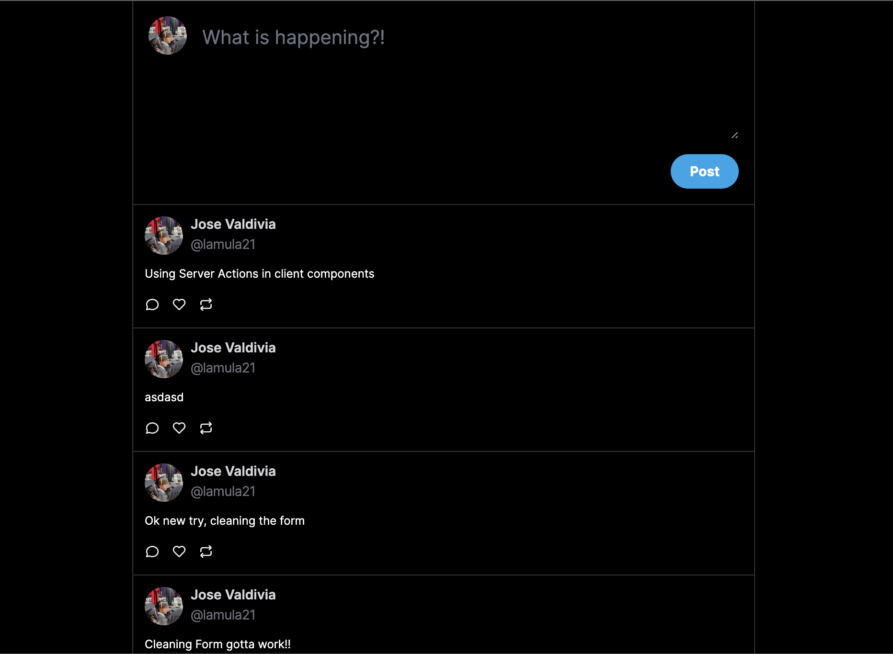

# Twitter Clone with Next.js + Supabase + Typescript + Tailwindcss

## Demo

## Features

- Next.js for server-side rendering and client-side JavaScript
- Implemented experirmental next.js feature: server actions
- Supabase for database access and authentication with Github
- Tailwind for styling
- Typescript for a strong typed javascript
